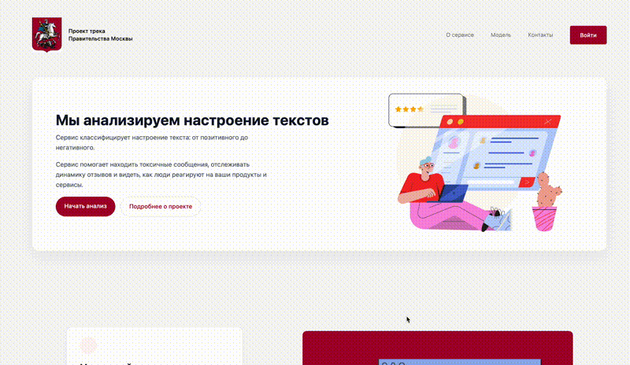
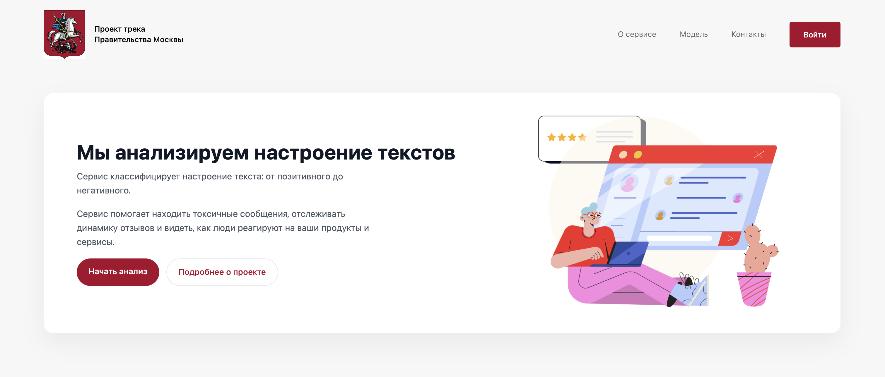
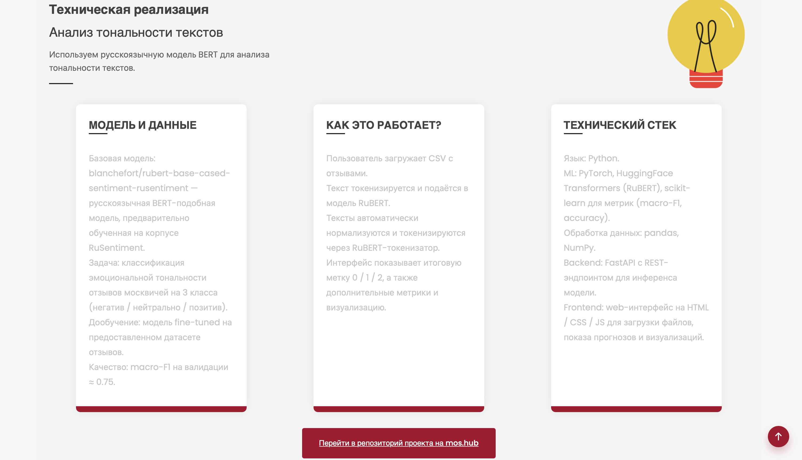
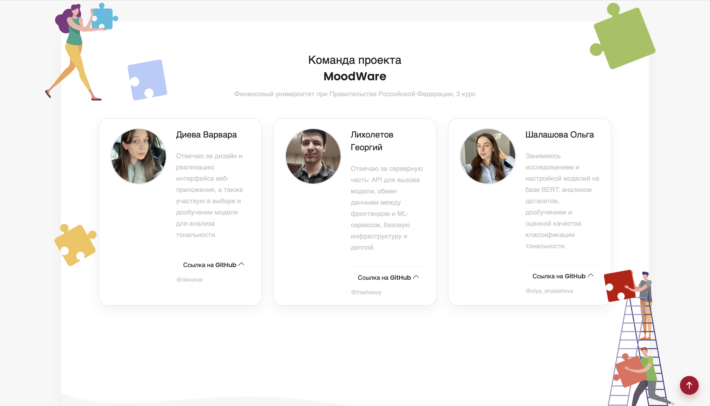
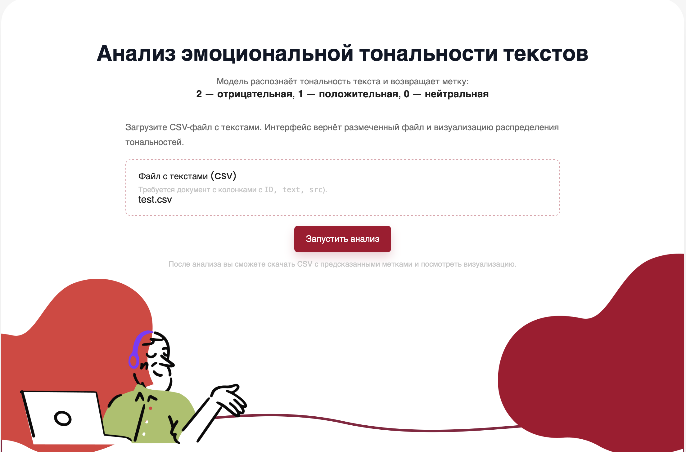
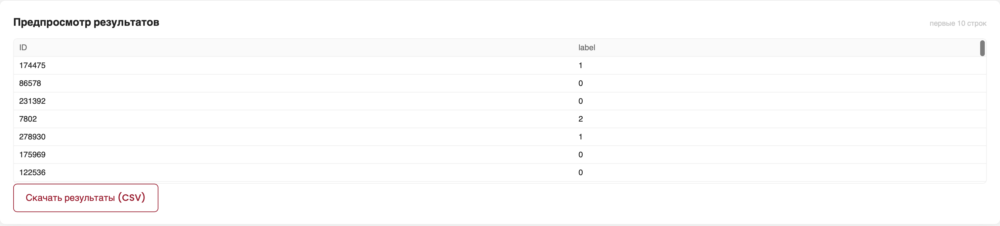
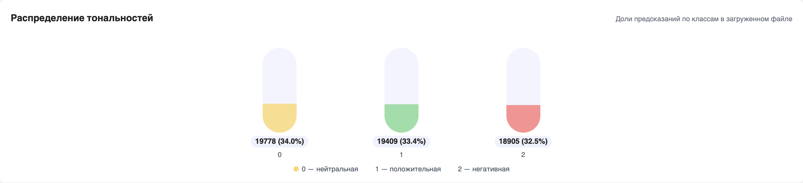
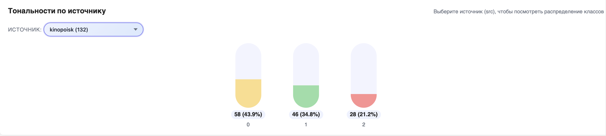
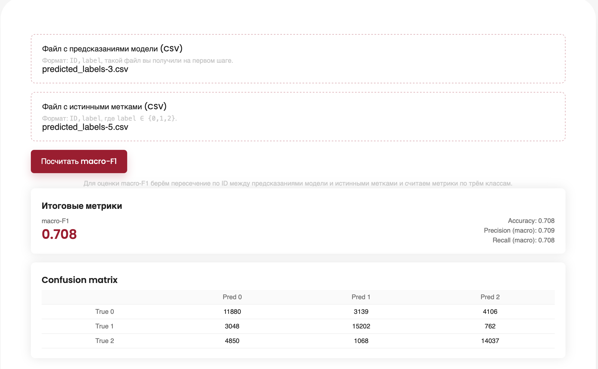

# MosHack-Change 2025 — Анализатор тональности отзывов

<div align="center">

[](https://python.org)
[](https://fastapi.tiangolo.com)
[](https://huggingface.co/transformers)
[](https://jupyter.org)
[](https://pytorch.org)
[](https://scikit-learn.org)
[](https://hackchange.ru)

*Проект хакатона Hack&Change 2025*

</div>


## Постановка задачи

Проект разработан в рамках хакатона Hack&Change 2025.  
Задача: классификация русскоязычных текстов по трём классам:

- 0 — отрицательная тональность,
- 1 — нейтральная,
- 2 — положительная.

Требования:

- загрузка CSV-файлов,
- нормализация текста,
- классификация и возврат размеченного CSV,
- визуализация распределения тональностей,
- вычисление macro-F1 на валидации,
- ручная правка разметки,
- фильтрация по источникам и ключевым словам,
- использование открытых моделей и библиотек,
- работа на CPU/GPU,
- корректный обмен данными между frontend и backend.

---

## Ссылки

### Основной репозиторий на mos.hub
https://hub.mos.ru/solmath/moshack-change_2025

Содержит:
- ноутбуки для обучения моделей,
- код подготовки данных,
- весь backend и frontend.

### Созданный прототип в фигме  
[https://www.figma.com/design/Jn1VWKOEAtMGraYBb4I0Uq/Hostus-Pocus?node-id=0-1&t=9ks20lZBQVufTpEp-1](https://www.figma.com/design/Jn1VWKOEAtMGraYBb4I0Uq/Hostus-Pocus?node-id=0-1&t=0YZGNLWrb6wN0OuS-1)

---

<div align="center">

## Демонстрация интерфейса

<div align="center">


*Загрузка данных → Анализ → Визуализация результатов*

</div>

### Главный экран
| Главная страница | Возможности сервиса |
|:---:|:---:|
|  |  |
| *Стартовый экран приложения* | *Описание функциональности* |

| Техническая реализация | Команда проекта |
|:---:|:---:|
|  |  |
| *Архитектура решения* | *Наша команда разработчиков* |

## Процесс анализа

| Страница анализа | Результаты анализа |
|:---:|:---:|
|  |  |
| *Интерфейс загрузки данных* | *Таблица с результатами* |

| Визуализация результатов | Проверка метрик |
|:---:|:---:|
|  <br>  |  |
| *Графики и диаграммы* | *Оценка качества модели* |

</div>
---

## Датасет

Исходные файлы:

- `data/ТОНАЛЬНОСТЬ/train.csv`
- `data/ТОНАЛЬНОСТЬ/test.csv`
- `sample_submission.csv`

Поля: `text`, `label`, `src`, `ID`.

Размеры:

- train: 232 366 строк
- test: 58 092 строк

Распределение классов:

- 0 — 77 243
- 1 — 77 494
- 2 — 77 629

Источники (11): anime, bank, geo, kinopoisk, linis, news, perekrestok, ru-reviews-classification, rureviews, rusentiment, sber.

### Подготовленные выборки

- `train_clean.csv` — 209 109
- `val_clean.csv` — 23 235
- `train_super.csv` — 106 311
- `val_super.csv` — 11 771
- `test_super.csv` — 58 092

### Основной препроцессинг

- удаление HTML, URL, email, телефонов,
- токены для эмодзи, брани, оценок, капса и английского текста,
- нормализация пунктуации и растянутых букв,
- сокращение длинных текстов до ~900 символов,
- добавление доменных токенов `[SRC_<источник>]`,
- мягкие аугментации (dropout + swap),
- ограничение 40 000 записей на источник,
- стратифицированный train/val сплит 90/10.

---

## Структура репозитория

```

SentimentAnalysis/
├── backend/
│   ├── model/
│   ├── app_bert.py
│   └── preprocess_test.py
│
├── frontend/
│   ├── css/
│   ├── img/
│   ├── js/
│   ├── index.html
│   └── index_model.html
│
├── data/
│   ├── ТОНАЛЬНОСТЬ/
│   ├── processed/
│   ├── embeddings_xlmr/
│   └── cache/
│
├── notebooks/
│   ├── preprocess.py
│   ├── preprocess.ipynb
│   ├── baseline.ipynb
│   ├── bert_tf_cv.ipynb
│   ├── train_rurorberta_base_manual.ipynb
│   ├── train_rurorberta_tiny_manual.ipynb
│   ├── train_rubert_base_conv.ipynb
│   ├── train_xlmr_base.ipynb
│   └── eval_model_universal.ipynb
│
├── models/
│   ├── rurorberta_base2_manual/
│   ├── rurorberta_tiny_manual/
│   ├── rubert_base_conv_manual/
│   ├── sentiment_*.joblib
│   └── ensemble_config_cv*.json
│
├── src/
│   ├── data_utils.py
│   ├── train_model.py
│   ├── inference.py
│   └── models/
│
├── pretrained/
├── requirements.txt
├── environment.yml
└── README.md

````

---

## Последовательность работы

### 1. Создание окружения

```bash
python -m venv .venv
source .venv/bin/activate
````

или:

```bash
conda env create -f environment.yml
```

### 2. Установка зависимостей

```bash
pip install -r requirements.txt
```

Если torch не устанавливается:

```bash
pip install torch
```

### 3. Подготовка данных

```bash
python notebooks/preprocess.py
```

Будут созданы:

* `train_super.csv`
* `val_super.csv`
* `test_super.csv`

### 4. Обучение моделей

Ноутбуки (в папке `notebooks/`):

* `train_rurorberta_base_manual.ipynb`
* `train_rurorberta_tiny_manual.ipynb`
* `train_rubert_base_conv.ipynb`
* `ubert-base-cased-sentiment-rusentiment.ipynb`
* `train_xlmr_base.ipynb`

### 5. Сборка ансамбля

* `bert_tf_cv.ipynb`
* `eval_model_universal.ipynb`

### 6. Запуск backend

```bash
uvicorn backend.app:app--reload
```
Документация:

* Swagger UI: [http://127.0.0.1:8000/docs](http://127.0.0.1:8000/docs)

---

## Метрики моделей (macro-F1 на val_super)

| Модель                                              | Ноутбук                                      | Macro-F1 |
| --------------------------------------------------- | -------------------------------------------- | -------- |
| blanchefort/rubert-base-cased-sentiment-rusentiment | ubert-base-cased-sentiment-rusentiment.ipynb | 0.7561   |
| DeepPavlov/rubert-base-cased-conversational         | train_rubert_base_conv.ipynb                 | 0.7347   |
| ai-forever/RuRoBERTa-base                           | train_rurorberta_base_manual.ipynb           | 0.7338   |
| FacebookAI/xlm-roberta-base (дообученная)           | train_xlmr_base.ipynb                        | 0.7213   |
| cointegrated/rubert-tiny2                           | train_rurorberta_tiny_manual.ipynb           | 0.6871   |
| Ансамбль BERT + TF-IDF                              | bert_tf_cv.ipynb                             | 0.6642   |
| TF-IDF + Logistic Regression                        | baseline.ipynb                               | 0.6222   |
| TF-IDF + SVD + HGB                                  | baseline.ipynb                               | 0.6101   |
| TF-IDF + LinearSVC                                  | baseline.ipynb                               | 0.5997   |

---


